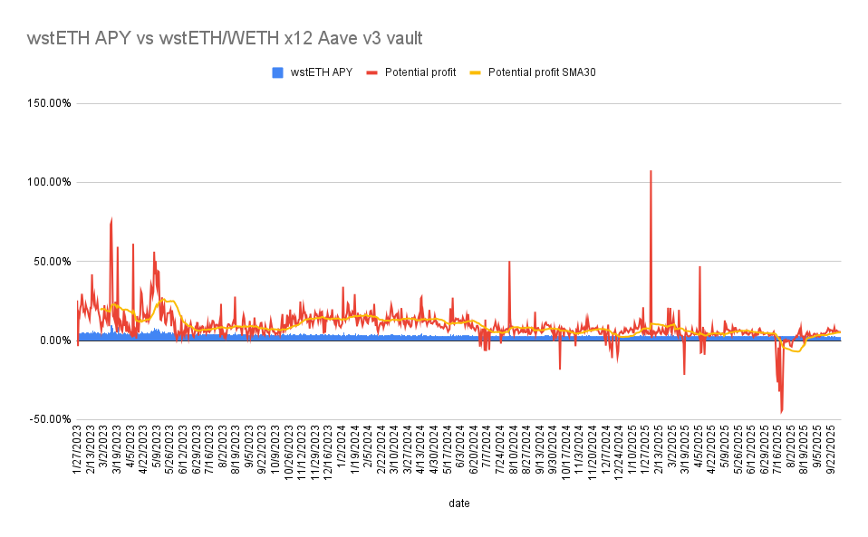

# Pilot Vault - wstETH ↔ ETH Vault (AAVE v3)

The LTV Protocol's first production vault, the **wstETH (Lido) ↔ ETH Vault**, enables leveraged staking on Ethereum by combining Lido's liquid staking with AAVE v3's lending capabilities.

The wstETH ↔ ETH Vault is designed to maximize yield from Ethereum staking through leveraged positions while maintaining a constant target Loan-To-Value (LTV) ratio. 

## Vault Specifications

| Parameter | Value |
|-----------|-------|
| **Collateral Asset** | wstETH (Lido) |
| **Borrow Asset** | ETH |
| **Target Leverage** | 12x |
| **Target APY** | 4.3% (historical 2025 average) |
| **Lending Protocol** | AAVE v3 |
| **Network** | Ethereum Mainnet |

## Launch Process

The wstETH ↔ ETH Vault follows LTV Protocol’s [four-phase launch process](./vaults_launch.md): it begins with internal team capital to verify integrations and system stability, then expands to whitelisted private LPs to test scalability. Next, access opens to 42 NFT holders for controlled community participation. Finally, the vault becomes permissionless and public, with capacity scaling based on risk parameters and available AAVE v3 liquidity.

## Rate-Risk Model

Even at **maximum pool utilization**, AAVE v3’s ETH borrow rate peaks around **10.6% APR**.  
At that rate, starting from **12× leverage**, the vault would only approach liquidation after roughly **92 days** without intervention.  

This creates a significant safety buffer, giving sufficient time to rebalance, unwind, or deleverage before any critical thresholds are reached.  
The vault’s oracle setup further minimizes liquidation risk by using **wstETH’s redemption price** (not market spot), making it resistant to short-term depegs or volatility shocks.

## Stability and Backtesting

Historical simulations demonstrate consistent yield premiums and stability under changing rate conditions.  
Since early 2023, while base ETH staking yield averaged **~3.48% APY**, the same position with **x12 leverage on AAVE v3** maintained an average yield of **~9.23% APY** — roughly **2.6× higher** than baseline staking performance.  

This yield consistency across multiple market regimes validates the model’s resilience and sustainability as a foundation for subsequent vaults.  

